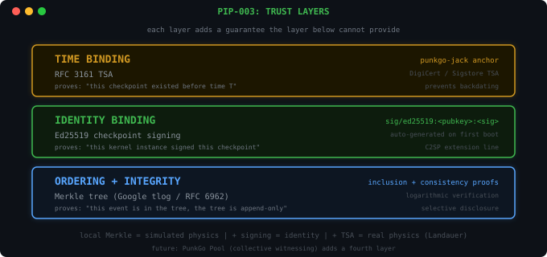
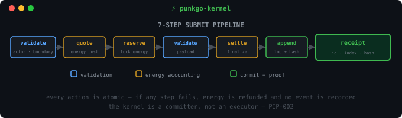

# PunkGo Kernel

[](https://github.com/PunkGo/punkgo-kernel/actions/workflows/ci.yml)
[](https://crates.io/crates/punkgo-kernel)

> Every AI action gets a receipt.

A local sovereignty compute kernel — append-only event system with cryptographic audit trails. The kernel is a **committer, not a judge**: it provides a single linearization point for actions and verifiable proofs, not moral authority.

<p align="center">
  
</p>

## Trust Layers

Each layer adds a guarantee the layer below cannot provide:

| Layer | Provides | Proves |
|-------|----------|--------|
| **Merkle** | Ordering + integrity | "this event is in the tree, the tree is append-only" |
| **Ed25519** | Identity binding | "this kernel instance signed this checkpoint" |
| **TSA** | Time binding | "this checkpoint existed before time T" |

A root operator with database access could rebuild the tree — this is the single-machine trust boundary. TSA (via [punkgo-jack](https://github.com/PunkGo/punkgo-jack)) adds time binding: you cannot backdate a timestamped checkpoint.

## Quick Start

```bash
cargo install punkgo-kernel    # installs punkgo-kerneld daemon
punkgo-kerneld                 # start the kernel
```

Pair with [punkgo-jack](https://github.com/PunkGo/punkgo-jack) for AI tool integration:

```bash
cargo install punkgo-jack
punkgo-jack setup claude-code  # install hooks into Claude Code
# every tool call now gets a cryptographic receipt
```

## How It Works

Every action goes through a **7-step pipeline** — validate, quote energy, reserve, check payload, settle, append to Merkle tree, return receipt.

<p align="center">
  
</p>

The receipt contains an event ID, log index, and cryptographic hash. Third parties can verify any event with an RFC 6962 inclusion proof — 3 hashes verify 1 event in 8; 20 hashes verify 1 event in a million.

## Evolution

| Version | What changed | Spec |
|---------|-------------|------|
| **v0.5.1** | Windows daemon.addr flock fix (separate lock from info) | [CHANGELOG](CHANGELOG.md) |
| v0.5.0 | Ed25519 checkpoint signing, trust layer architecture | [PIP-003](docs/PIP-003_EN.md) |
| v0.4.0 | Per-PID IPC, single-instance guard, `--replace` | [CHANGELOG](CHANGELOG.md) |
| v0.3.0 | Energy starvation fix, Windows IPC fix | [CHANGELOG](CHANGELOG.md) |
| v0.2.0 | Execute submission — kernel commits, agent executes | [PIP-002](docs/PIP-002_EN.md) |
| v0.1.0 | Energy + Actors + Boundaries + Consent + Merkle audit | [PIP-001](docs/PIP-001_EN.md) |

## Ecosystem

- **[punkgo-jack](https://github.com/PunkGo/punkgo-jack)** — AI tool hook adapter (Claude Code, Cursor). Every tool call gets a receipt + optional RFC 3161 TSA timestamp
- **[punkgo-watchdog](https://github.com/PunkGo/punkgo-watchdog)** — real-time kernel monitor with terminal dashboard

## Documentation

| Document | Description |
|----------|-------------|
| [Whitepaper](docs/PunkGo_Whitepaper_EN.md) ([ZH](docs/PunkGo_Whitepaper_ZH.md)) | Foundational axioms, world model, 7 invariants |
| [PIP-001](docs/PIP-001_EN.md) ([ZH](docs/PIP-001_ZH.md)) | Energy, actors, boundaries, consent |
| [PIP-002](docs/PIP-002_EN.md) ([ZH](docs/PIP-002_ZH.md)) | Execute submission |
| [PIP-003](docs/PIP-003_EN.md) ([ZH](docs/PIP-003_ZH.md)) | Checkpoint authentication |
| [Architecture](docs/ARCHITECTURE.md) | Crate structure, pipeline, IPC |
| [Tool Definitions](specs/kernel-tools.json) | MCP-compatible JSON schemas |

## Design Philosophy

- **Committer, not judge** — single linearization point, not moral authority
- **No a-priori restrictions** — opt-in design, not pre-emptive
- **Append-only** — errors corrected by compensating events, never rewriting
- **Hardware-anchored** — energy tied to physical compute (INT8 TOPS)

## License

[MIT](LICENSE)
